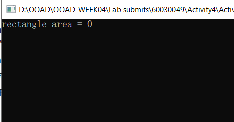

# เมธอดที่ส่งค่ากลับ 

## แนะนำ

เมธอดสามารถส่งค่ากลับไปให้ผู้เรียก เพื่อนำค่าไปใช้งานต่อไป ซึ่งงานส่วนใหญ่ก็จะมีลักษณะเป็นเช่นนั้น

การเขียนเมธอดที่ส่งค่ากลับ สามารถเขียนได้หลายแบบ แต่เมธอดหนึ่งๆ จะส่งค่ากลับผ่าน return type ได้เพียงค่าเดียวเท่านั้น


## การทดลอง 
1. ให้สร้าง project ใหม่ ชื่อ Activity4   
   1.1 ชนิดโปรเจค เป็น Empty Project (.NET Framework) ภาษา C#  
   1.2 ถ้ามีไฟล์ใดๆ ที่มีนามสกุล .cs ให้ลบออกให้หมด  
   1.3 คลิกเมนู Project เลือก Add New Item...  
   1.4 เลือก class และในช่อง Name: ตั้งชื่อเป็น Rectangle และคลิก Add  
2. ในไฟล์ Rectangle.cs ให้ลบเนื้อหาออกให้หมด แล้วพิมพ์โค้ดต่อไปนี้

``` C#
class Rectangle
{
    public static double Area(double Width, double Height)
    {
        double result = 0.0;
        return result;
    }

    static int Main()
    {
        double rectArea = Area(10, 20);
        System.Console.WriteLine("rectangle area = " + rectArea.ToString());
        System.Console.ReadKey();
        return 0;
    }
}
```
3. รันโปรแกรมและบันทึกผลการทดลอง




### เมธอดสามารถส่งค่าตัวแปรที่เก็บผลลัพธ์จากการคำนวณ
4. ให้แก้ไขโค้ดในเมธอด `public double Area()` (ไม่ต้องแก้โค้ดในเมธอด `Main`) 
``` C#
class Rectangle
{
    public static double Area(double Width, double Height)
    {
        double result = 0.0;
        result = Width * Height;
        return result;
    }

    static int Main()
    {
        ...
    }
}

```
5. รันโปรแกรมและบันทึกผลการทดลอง


### เมธอดสามารถส่งค่าตัวแปรที่เก็บผลลัพธ์จากการคำนวณ
6. ให้แก้ไขโค้ดในเมธอด `public double Area()` (ไม่ต้องแก้โค้ดในเมธอด `Main`) 

``` C#
class Rectangle
{
    public double Area()
    {
        // ส่งกลับค่าจากการคำนวณโดยตรง
        return Width * Height;
    }
}

```

7. รันโปรแกรมและบันทึกผลการทดลอง


### เมธอดไม่จำเป็นต้องมีส่วน body (ภายในบล็อกของ {})
8. ให้แก้ไขโค้ดให้เป็นดังต่อไปนี้

```C#
class Rectangle
{
    static double w, h;
    // เมธอดที่ไม่ต้องมีส่วน body
    public static double calculateArea() => w * h;

    static int Main()
    {
        w = 10;
        h = 20;
        double area = calculateArea();
        System.Console.WriteLine("rectangle area = " + area.ToString());
        System.Console.ReadKey();
        return 0;
    }
}
```

7. รันโปรแกรมและบันทึกผลการทดลอง


